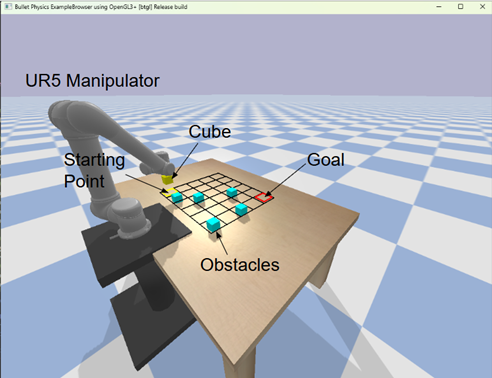

# Assignment: Grid Navigation using Dynamic Programming

## Overview
The goal of this assignment is to implement Dynamic Programming algorithms for robotic path planning. You will implement **Policy Iteration** and **Value Iteration** to compute optimal policies for navigating UR5 robotic manipulator on a grid world with obstacles.

## Simulation Environment
The simulation environment uses **PyBullet** for 3D visualization and realistic physics simulation. The UR5 manipulator navigates on a m×n grid with randomly placed obstacles.

<p align="center">
  
</p>

## Exercises
The assignment has **5 core exercises**:

### Part 1: Policy Evaluation
Implement iterative policy evaluation using the Bellman expectation equation.

### Part 2: Q-value Computation
Implement the function to compute action-value function Q(s,a) from state-value function V(s).

### Part 3: Policy Improvement
Implement policy improvement to derive a greedy policy from a value function.

### Part 4: Policy Iteration
Implement the complete policy iteration algorithm by alternating between evaluation and improvement.

### Part 5: Value Iteration
Implement value iteration using the Bellman optimality equation.

For each part, you are expected to:
- Implement the function in `utils.py`
- Ensure it converges correctly
- Test with the provided grid environment

## Deliverables

- **Completed code** with all 5 DP algorithms implemented
- **Simulation demonstration** including but not limited to:
    - Display the optimal path from start to goal
    - Show the robot moving along the path
    - Draw a green trail showing the end-effector trajectory
    - Add visualization of value function as a heatmap


</p>
- **Analysis report** including but not limited to:
   - Comparing Policy Iteration vs Value Iteration
   - Convergence speed (number of iterations)
   - Computation time
   - Path quality
   - Different reward structures (sparse vs dense)

## Extra Credits
- Mount UR5 on a mobile base, scale the grid and demonstrate one or more exercises above

## Setup Instructions

### Requirements
- Python 3.8+
- PyBullet: `pip install pybullet`
- NumPy: `pip install numpy`

### Installation
```bash
cd AR525-main
pip install -r requirements.txt
```

### Running the Code
```bash
python main.py
```

Initially, you will see only the static environment (grid, UR5, obstacles, markers). After implementing the DP algorithms, the robot will navigate to the goal.

## Code Structure

```
AR525-main/
├── main.py           # Main execution script with environment setup
├── utils.py          # YOUR IMPLEMENTATION HERE - DP algorithms
├── assest/           # 3D models for robot and environment
└── README.md         # This file
```

## Code Guide

### Step 1: Understand the Grid Environment
- States: 30 states (5 rows × 6 columns), numbered 0-29
- Actions: 4 actions (LEFT=0, DOWN=1, RIGHT=2, UP=3)
- Start: State 0 (top-left)
- Goal: State 29 (bottom-right)

### Step 2: Implement DP Algorithms in `utils.py`

#### `policy_evaluation(env, policy, gamma, theta)`
Evaluate a policy using the Bellman expectation equation:
```
V(s) = Σ_a π(a|s) Σ_{s',r} P(s',r|s,a)[r + γV(s')]
```

#### `q_from_v(env, V, s, gamma)`
Compute Q-values from V-values:
```
Q(s,a) = Σ_{s',r} P(s',r|s,a)[r + γV(s')]
```

#### `policy_improvement(env, V, gamma)`
Derive greedy policy:
```
π(s) = argmax_a Q(s,a)
```

#### `policy_iteration(env, gamma, theta)`
Alternate between evaluation and improvement until convergence.

#### `value_iteration(env, gamma, theta)`
Update values using Bellman optimality:
```
V(s) = max_a Σ_{s',r} P(s',r|s,a)[r + γV(s')]
```

### Step 3: Add Simulation Code in `main.py`
After implementing DP algorithms, add code to:
- Call `policy_iteration()` or `value_iteration()`
- Extract optimal path using `env.get_optimal_path(policy)`
- Move robot using Inverse Kinematics (`p.calculateInverseKinematics()`)
- Draw green trail showing the path

## Submission Guidelines

### What to Submit
- **Code files (zip)**:
- **Report (PDF)**:
- **Video demonstration** (optional but recommended):

### Note
- This assignment is to be done in pairs (working in pairs is recommended and will be rewarded). The choice is yours.

- Please submit it on google form as a single zip file named <A1_StudentID>.zip or <A1_StudentID1_StudentID2>.zip. The zip file should contain a full code, running instructions, and analysis in the PDF file.
- The submission date is 5:00 pm IST on Thursday, 5 Feb, 2026. Late submission will incur a daily 10% score adjustment for up to two days.

### Grading Criteria
- **Implementation (60%)**:
  - Correctness of DP algorithms
  - Code quality and documentation
  - Proper convergence

- **Simulation (20%)**:
  - Robot follows optimal path
  - Smooth visualization
  - Proper obstacle avoidance

- **Analysis (20%)**:
  - Quality of comparison
  - Insights and observations
  - Clarity of presentation

## Tips and Hints

- **Start Simple**: Test your implementations on a smaller 3×3 grid first
- **Debug Values**: Print V(start) and V(goal) to verify convergence
- **Check Convergence**: Implement proper stopping criteria using delta < theta
- **Vectorize**: Use NumPy operations for faster computation
- **Handle Edge Cases**: States at grid boundaries should stay in place for invalid actions

## Common Issues

**Q: The algorithms don't converge**
- Check that you're updating all states in each iteration
- Verify the Bellman equations are implemented correctly
- Ensure gamma < 1.0 for guaranteed convergence

**Q: The robot doesn't move**
- Make sure you've implemented the simulation code in `main.py`
- Check that the optimal path is non-empty
- Verify IK is computing valid joint angles

**Q: Path goes through obstacles**
- The basic grid environment doesn't include obstacle collision
- Obstacles are for visualization only in the base assignment
- For extra credit, modify `_get_next_state()` to avoid obstacles

## References

- Sutton & Barto, "Reinforcement Learning: An Introduction" (Chapter 4: Dynamic Programming)
- [OpenAI Spinning Up - Value Iteration](https://spinningup.openai.com/en/latest/spinningup/rl_intro.html)


**Good luck with your implementation! 🚀**

## Acknowledgements
Thanks Jagannath Prasad Sahoo (@Jaggu2606) and Dharmendra Sharma (TAs) for their help in preparing this assignment.
