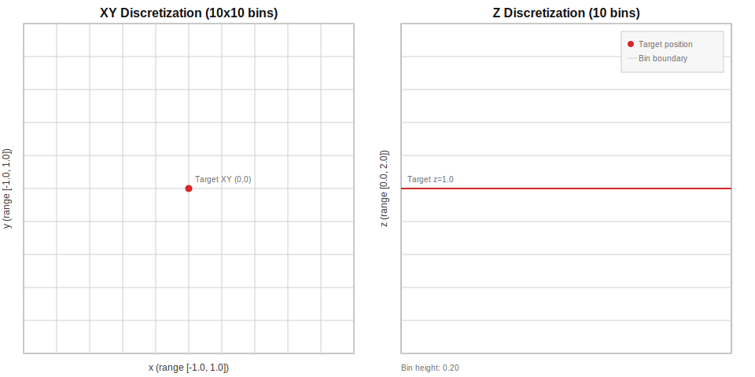
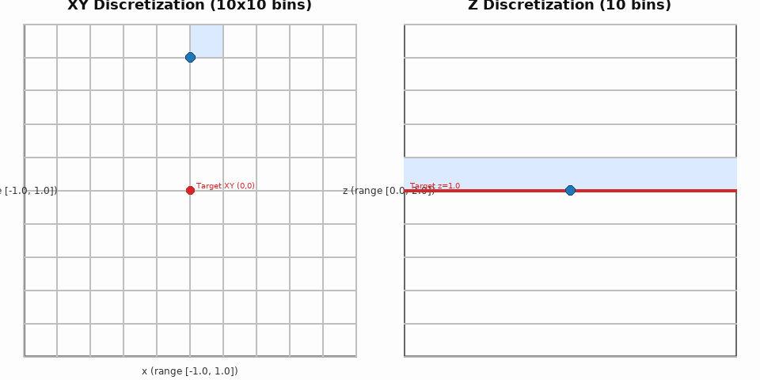

# Assignment: Drone hovering using Model-free control
 The goal of this assignment is to implement **Monte Carlo Control** and **Q-Learning** algorithms to teach a drone to hover at target position `[x, y, z]`. Drone hovering is challenging because small action errors accumulate quickly and the drone can drift or oscillate. The drone must balance exploration vs. stability, learn from delayed rewards, and generalize across nearby states to hold a steady hover. The expected behaviour of drone is shown below:


## What Students Will Learn

- **Monte Carlo Control**: First-visit MC with epsilon-greedy exploration
- **Q-Learning**: Off-policy TD control with max Q-value updates
- **State Discretization**: Converting continuous position to discrete bins
- **Policy Improvement**: Greedy policies from learned Q-values
- **Hyperparameter Tuning**: Finding optimal learning rates and exploration rates

## Important: Dependencies

This assignment **requires** the `gym-pybullet-drones` package to be installed. You have two options:

### Option 1: Install from Source (Recommended)
```bash
# Clone and install gym-pybullet-drones
git clone https://github.com/utiasDSL/gym-pybullet-drones.git
cd gym-pybullet-drones
pip install -e .

# Then clone/use this assignment repo
cd ..
git clone https://github.com/zsxacdvbbnm16/a2-ar525.git
cd a2-ar525
```

### Option 2: Install via pip (if available)
```bash
pip install gym-pybullet-drones
git clone https://github.com/zsxacdvbbnm16/a2-ar525.git
cd a2-ar525
```

## Task Description

**Environment**: HoverAviary - A single drone must hover at target position `[x, y, z]`

**State Space**: 3D position (x, y, z) relative to target, discretized into 10 bins per dimension

**Action Space**: 3 discrete actions representing thrust adjustments: `-1` (down), `0` (maintain), `+1` (up)

**Reward**: Based on proximity to target position (higher reward for being closer)

**Episode Termination**: Episode ends after 240 steps (8 seconds) or when the environment reports termination (e.g., crash)

## State Discretization (Visual)

The state is discretized into 10 bins per dimension. Below is a visual of the XY grid and the Z bins used by `discretize_state()`:






## Clarifications (to avoid confusion)

- **What students must implement**: `run_monte_carlo()` and `run_q_learning()` in `user_code.py`. These correspond to **Monte Carlo Control** and **Q-Learning (TD Control)**.
- **What is optional/bonus**: SARSA, Double Q-Learning, and Experience Replay are **bonus challenges only**.
- **Episode termination (applies to MC and Q-Learning)**: Stop the episode when `terminated` or `truncated` is true, or when `MAX_STEPS` is reached (240 steps).
- **Target objective**: The goal is to **stabilize/hover at the target position** `[0, 0, 1]` (not to fly a trajectory).
- **State space extensions**: For the core assignment, keep state as **position only**. Students may optionally extend the state (e.g., include velocity or orientation), but they must update:
  - `STATE_DIM`
  - `discretize_state()` bounds and logic
  - Q-table shape (`get_q_table_shape()`)
  - Any plotting/analysis that assumes 3D state
- In `td_learning.py`, the GUI window may close and reopen once: this is expected because the script runs **Q-Learning first**, then resets and runs **SARSA**.
Console messages about threads/GL context shutdown/startup are normal PyBullet GUI lifecycle logs.
## Files

| File | Description |
|------|-------------|
| `monte_carlo.py` | Reference implementation of Monte Carlo Control |
| `td_learning.py` | Reference implementation of Q-Learning |
| `user_code.py` | **Student template** - Implement your solutions here |
| `bonus_challenges.py` | **BONUS CHALLENGES** - Extra credit opportunities |
| `evaluate_submission.py` | Automated grading script |
| `Screenshot.png` | Visual preview of the environment |
| `README.md` | This file with complete instructions |

## Setup

```bash
# Navigate to the assignment directory
cd a2/   # or your-directory/

# Create virtual environment (recommended)
python -m venv venv
source venv/bin/activate  # On Windows: venv\Scripts\activate

# Install dependencies
pip install -r requirements.txt

# IMPORTANT: Install gym-pybullet-drones
# Option A: From source
git clone https://github.com/utiasDSL/gym-pybullet-drones.git
cd gym-pybullet-drones
pip install -e .
cd ../rl_assignment/

# Option B: Direct install (if available)
pip install gym-pybullet-drones
```

## Requirements

```
numpy>=1.20
gymnasium>=0.29
pybullet>=3.2
matplotlib>=3.5
gym-pybullet-drones  # MUST be installed separately
```

## Assignment Instructions

### Part 1: Monte Carlo Learning

Implement `run_monte_carlo()` in `user_code.py`:

1. **Generate episodes** using epsilon-greedy policy
2. **Compute returns** (discounted cumulative rewards) for each timestep
3. **Update Q-values** using first-visit MC: average of returns
4. **Improve policy** to be greedy w.r.t. Q-values

### Part 2: Q-Learning (TD Learning)

Implement `run_q_learning()` in `user_code.py`:

1. **Initialize state** and choose action (epsilon-greedy)
2. **Take action**, observe reward and next state
3. **Update Q-value**: `Q(s,a) = Q(s,a) + α[r + γ max_a' Q(s',a') - Q(s,a)]`
4. **Repeat** until episode ends

### Part 3: Experiments

1. **Tune hyperparameters**: Try different values for `NUM_BINS`, `EPSILON`, `GAMMA`, `ALPHA`
2. **Plot learning curves**: Track episode rewards over time
3. **Compare algorithms**: Which performs better and why?
4. **Analyze convergence**: How many episodes needed for good performance?

## Running Your Code

```bash
# Run student template
python user_code.py

# Evaluate your submission (recommended: deterministic + multi-seed)
python evaluate_submission.py --student_file user_code.py --method all --seed 42 --min_reward 220 --eval_seeds 3

# Or evaluate specific method
python evaluate_submission.py --student_file user_code.py --method mc   # Monte Carlo only
python evaluate_submission.py --student_file user_code.py --method td   # TD only

# You can tune grading settings if needed
# --seed: reproducible randomness
# --min_reward: pass threshold per method
# --eval_seeds: number of seeds averaged for evaluation stability
```

## Visualization (GUI)

This assignment is **tabular RL** (Q-table based). To visualize hover behavior with the reference implementations, run:

```bash
# Visualize Monte Carlo reference (opens PyBullet GUI)
python monte_carlo.py

# Visualize Q-Learning reference (opens PyBullet GUI)
python td_learning.py
```

Note: `user_code.py` runs with `gui=False` by default for faster grading/training.

### What You Should See During Visualization

- The drone should increasingly stabilize near `z = 1.0` as training progresses.
- In `td_learning.py`, the GUI window may close and reopen once: this is expected because the script runs **Q-Learning first**, then resets and runs **SARSA**.
- Console messages about threads/GL context shutdown/startup are normal PyBullet GUI lifecycle logs.

## Grading Rubric (Total: 100 points)

| Component | Weight | Criteria |
|-----------|--------|----------|
| Monte Carlo | 30% | Episode generation, return calculation, first-visit update, policy improvement |
| Q-Learning | 30% | TD update rule, max Q-value calculation, epsilon-greedy selection, convergence |
| Experiments | 25% | Hyperparameter tuning, learning curves, comparison, analysis |
| Code Quality | 15% | Readability, documentation, proper naming, comments |

**Passing Threshold**: 70% overall

## BONUS CHALLENGES (Extra Points!)

Complete these advanced challenges for extra credit!

| Challenge | Points | Difficulty | Description |
|-----------|--------|------------|-------------|
| **SARSA** | 5 pts | ⭐ | On-policy TD control using actual next action |
| **Double Q-Learning** | 7 pts | ⭐⭐ | Reduce maximization bias with dual Q-tables |
| **Experience Replay** | 8 pts | ⭐⭐⭐ | Mini-batch learning with replay buffer |

### How Bonus Points Work

- Complete all 3 challenges and score ≥300: **+20 bonus points**
- Complete 2 challenges and score ≥300: **+12 bonus points**
- Complete 1 challenge and score ≥300: **+5-8 bonus points**

### Running Bonus Challenges

```bash
python bonus_challenges.py
```

### Bonus Challenge Details

#### Challenge 1: SARSA (5 points)
Implement SARSA instead of Q-Learning. SARSA uses the actual next action from the epsilon-greedy policy, making it more conservative for learning policies near boundaries.

**Update Rule**: `Q(s,a) = Q(s,a) + α[r + γ Q(s',a') - Q(s,a)]`

#### Challenge 2: Double Q-Learning (7 points)
Implement Double Q-Learning to reduce maximization bias that occurs in standard Q-Learning. Uses two Q-tables and alternates updates between them.

**Key Idea**: Use one Q-table for action selection and the other for evaluation.

#### Challenge 3: Experience Replay (8 points)
Implement Experience Replay buffer to store (s,a,r,s',done) tuples and learn from randomly sampled mini-batches. This significantly improves learning stability and sample efficiency.

**Benefits**: Reduces correlation between consecutive experiences, enables offline learning from past data.

---

## Hyperparameters

Tune these for best performance:

- `NUM_BINS`: State discretization granularity (try 8-15)
- `EPSILON`: Exploration rate (try 0.05-0.3)
- `GAMMA`: Discount factor (try 0.95-0.999)
- `ALPHA`: Learning rate (try 0.05-0.2)
- `NUM_EPISODES`: Number of training episodes (500-1000)

## Repository Structure

```
rl_assignment/
├── README.md                 # This file with complete instructions
├── requirements.txt         # Python dependencies
├── monte_carlo.py           # Reference MC implementation
├── td_learning.py           # Reference TD implementation
├── user_code.py             # Student template (submit this)
├── bonus_challenges.py      # Bonus challenges (optional)
├── evaluate_submission.py   # Grading script
├── Screenshot.png           # Visual preview of the environment
```

## Submission

1. Complete `user_code.py` with your Monte Carlo and Q-Learning implementations
2. Run `python evaluate_submission.py --student_file user_code.py --method all --seed 42 --min_reward 220 --eval_seeds 3` to check your score
3. Ensure both MC and TD pass (score >= 70%)
4. **(Optional)** Complete `bonus_challenges.py` for extra credit
5. Submit your `user_code.py` (and `bonus_challenges.py` if attempting bonuses)
6. Please submit it on [**Google Form**](https://forms.gle/zEUeykZbJvzh8LWj8) as a single zip file named <A1_StudentID>.zip or <A1_StudentID1_StudentID2>.zip. The zip file should contain a full code, running instructions, and analysis in the PDF file.
7. The submission deadline is **5:00 pm IST on Thursday, 19 Mar, 2026**. Late submission will incur a daily 10% score adjustment for up to two days.

## References

- [Sutton & Barto - Reinforcement Learning](http://incompleteideas.net/book/the-book-2nd.html)
- [Monte Carlo Methods](http://incompleteideas.net/book/ebook/node49.html)
- [Q-Learning](http://incompleteideas.net/book/ebook/node47.html)
- [gym-pybullet-drones Documentation](https://github.com/utiasDSL/gym-pybullet-drones)

## License
This assignment is provided for educational purposes.

**Good luck with your implementation! 🚀**

## Acknowledgements
Thanks Sadbhav Singh [(@sadbhavsingh16)](https://github.com/sadbhavsingh16) for his help in preparing this assignment.
