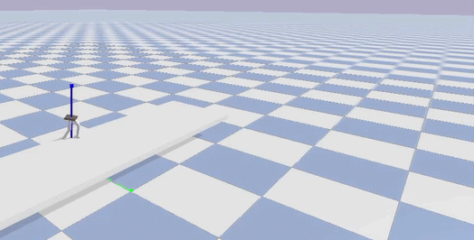

# Assignment 3 — Biped Platform Jump with Deep Reinforcement Learning

## Overview

In this assignment, you will train a simulated biped robot to **jump off a 1 m platform and land upright** using the **SAC (Soft Actor-Critic)** algorithm. The environment image and expected output is shown below:

<p align="center">
  
</p>

The robot spawns on top of a 1 m tall platform and must:
1. **Crouch and leap** off the edge
2. **Maintain an upright orientation** during flight
3. **Land stably** on the ground below

The environment (`BipedJumpEnv` in [`utils.py`](utils.py)) wraps PyBullet: a 6-DoF biped (3 DoF per leg) (`assest/biped_.urdf`) spawns on a box platform and must reach a stable landing on the flat ground.

---

## Repository structure

```
Assignment-3/
├── main.py            # ← Entry-point YOU will implement (train / test / view)
├── utils.py           # Environment + hyperparameters + callback (provided)
├── assest/
│   ├── biped_.urdf    # Robot model (provided)
│   └── stair.urdf     # Stair model (provided — for reference)
├── requirements.txt   # Python dependencies
└── models jump/       # Saved models (created automatically during training)
```

---

## Setup

```bash
# 1. Create a virtual environment (recommended)
python -m venv venv
source venv/bin/activate        # Windows: venv\Scripts\activate

# 2. Install dependencies
pip install -r requirements.txt
```

> **Note:** PyBullet GUI rendering requires a display. On headless servers use `--render` only locally or via VNC/X11.

---

## Quick start

### Preview the environment
```bash
# Spawn the biped on the platform in the GUI (no model needed)
python main.py --mode view --task jump
```

### Train
```bash
# Train SAC for the default number of timesteps (set in utils.py)
python main.py --mode train --algo sac --task jump

# Quick smoke-test with fewer steps
python main.py --mode train --algo sac --task jump --timesteps 200000

# Train with GUI (slow — only for debugging)
python main.py --mode train --algo sac --task jump --render
```

Training produces:
- `models jump/sac_biped_goal.zip` — final model
- `models jump/sac_best/best_model.zip` — best checkpoint (by eval reward)
- `reward_curve_sac.png` — episode reward plot
- `logs/sac_monitor.csv` — per-episode stats

### Evaluate
```bash
# Evaluate the best SAC checkpoint (headless, 10 episodes)
python main.py --mode test --algo sac --task jump

# Evaluate with GUI rendering
python main.py --mode test --algo sac --task jump --render --episodes 5

# Evaluate a specific model file
python main.py --mode test --algo sac --task jump \
    --model_path "models jump/sac_best/best_model" \
    --episodes 10
```

---

## Tasks

### Task 1 — Implement `main.py` (50 pts)

The file [`main.py`](main.py) is a skeleton. You must implement all sections marked `# TODO`:

| Function | What to implement |
|----------|-------------------|
| `TASK_ENV` | Register `BipedJumpEnv` under the key `"jump"` |
| `ALGO_MAP` | Register SAC (and optionally DDPG / TD3) with their configs |
| `view()` | Spawn the env in GUI mode and step the simulation in a loop |
| `train()` | Create envs, instantiate SAC, attach callbacks, call `model.learn()` |
| `test()` | Load a model, run evaluation episodes, compute and print metrics |
| `main()` | Route CLI arguments to the correct function |

> **Tip:** Implement and test `view()` first — it lets you confirm the environment loads correctly before training.

---

### Task 2 — Train SAC and tune hyperparameters (25 pts)

Train SAC for **at least 500,000 timesteps**. Then tune the hyperparameters in [`utils.py`](utils.py) (`SAC_CONFIG`) and try **at least three different configurations**.

Suggested parameters to explore:

| Parameter | Effect |
|-----------|--------|
| `learning_rate` | Gradient step size  |
| `batch_size` | Mini-batch size  |
| `gamma` | Discount factor — affects how far-sighted the agent is |
| `ent_coef` | `"auto"` or a fixed float — controls exploration vs exploitation |
| `buffer_size` | Replay buffer capacity — reduce if running out of memory |

For each configuration save the reward curve and report the final evaluation reward.

---
### Task 3 — Evaluate and report metrics (25 pts)
Run `python main.py --mode test --algo sac --task jump --episodes 10` and collect:
| Metric | Description |
|--------|-------------|
| **Average Reward** | Mean total reward per episode |
| **Fall Rate (%)** | Percentage of episodes that ended in a crash |
| **Average Distance (m)** | Mean displacement from spawn to landing |
| **Average Energy (J)** | Mean mechanical energy: `sum(|torque × velocity| × dt)` |
| **Cost of Transport (CoT)** | `Energy / (mass × g × distance)` — locomotion efficiency |

Present results across your three hyperparameter configurations in a table. 
Write a short analysis (~200 words) discussing which configuration performed best and why.

---

## Submission checklist
Your submission must include:
- Completed `main.py` (all TODOs implemented)
- Training reward curves for each hyperparameter configuration
- Hyperparameter tuning results table (Task 2)
- Evaluation metrics table (Task 3)
- Brief conclusion: what made the agent succeed or struggle?
- Please submit it on [**Google Form**](https://forms.gle/cNuCb51f9HShMg4j7) as a single zip file named <A1_StudentID>.zip or <A1_StudentID1_StudentID2>.zip. The zip file should contain a full code, running instructions, and analysis in the PDF file.
- The submission deadline is **5:00 pm IST on Wednesday, 15 Apr, 2026**. Late submission will incur a daily 10% score adjustment for up to two days.

---

## Grading rubric
| Component | Marks |
|-----------|-------|
| Task 1 — `main.py` implementation | 50 |
| Task 2 — Training and hyperparameter tuning | 25 |
| Task 3 — Evaluation and analysis | 25 |
| **Total** | **100** |
---
## Hints and common issues
- **Robot falls off the platform immediately**: the spawn height is `z = 1.81 m` (platform top + standing height). If it falls in the first step, check that the URDF loaded correctly with `--mode view`.
- **No landing reward**: the agent must reach `z < 1.15 m` with both feet contacting the ground. Watch the height signal in the observation.
- **Very slow training**: make sure `render=False` (default). Only use `--render` for final demos.
- **Out of memory**: reduce `buffer_size` in `SAC_CONFIG` (e.g. `500_000`).
- **Crash checkpoint**: if you interrupt training with Ctrl+C, the model is saved as `sac_biped_crashsave.zip` so you don't lose progress.
- **TensorBoard**: `tensorboard --logdir logs/` then open `http://localhost:6006`.
---
## References
- Haarnoja et al. (2018). *Soft Actor-Critic: Off-Policy Maximum Entropy Deep RL with a Stochastic Actor.* ICML.
- Stable-Baselines3 documentation: https://stable-baselines3.readthedocs.io
- PyBullet quickstart guide: https://pybullet.org
---
## Acknowledgements
Thanks Jagannath Prasad Sahoo [(@Jaggu2606)](https://github.com/Jaggu2606) for his help in preparing this assignment.